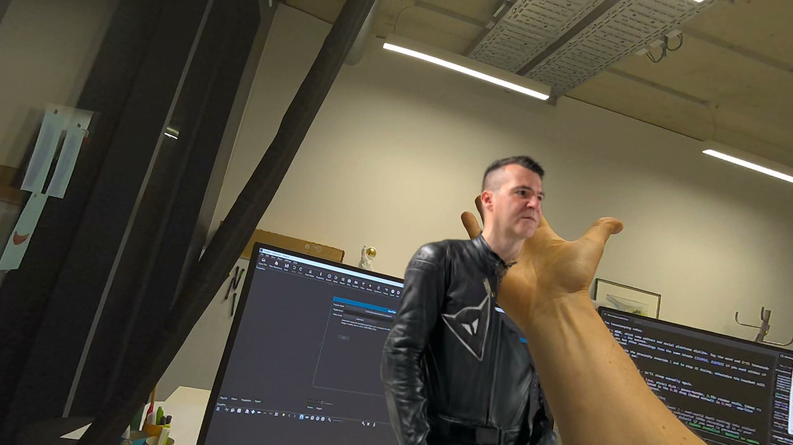

# WebXR Depth Occlusion on Quest 3

*A gaussian splat on a real desk. The hand is real, the biker is not — and the
depth sensors decide which is in front, per pixel, every frame.*

Real-world occlusion in a **web page**. The Quest's depth sensors are read every
frame and written straight into the depth buffer, so virtual objects — meshes
*and* gaussian splats — are hidden by your hands, your desk and your room, with
no per-material work and nothing installed.

By [arrival.space](https://arrival.space).

## Try it

**→ [Depth occlusion](https://fimbox.github.io/playcanvas-vr-twa-demo/?demo=occlusion)**
— a gaussian splat sitting on your desk, occluded by the real world.

**→ [Depth peeling](https://fimbox.github.io/playcanvas-vr-twa-demo/)** — a
lightning front sweeping outward through the depth field, mapped onto your
hands in stereo.

Open either link in the **Meta Quest Browser** on a Quest 3 or 3S and tap
*Enter Mixed Reality*. Grant depth/scene permission when asked. Nothing to
install.

Useful URL parameters: `?scale=0.75` (render scale, default 1.5),
`?demo=occlusion`.

## What it actually does

WebXR hands you a 320×320 depth map per eye. The eye buffer is ~2520 px wide,
so **one depth texel covers about eight screen pixels** — upsample it naively
and every silhouette is a staircase.

**Occlusion.** An empty layer is inserted first in the PlayCanvas render
composition. It takes the camera's clear, and its `postrender:layer` writes
`gl_FragDepth` from the sensor before any geometry draws. Everything after it
just depth-tests as usual — which is why splats work: a splat only needs to
*read* depth, not write it.

**Edge reconstruction.** The staircase is not noise, it is a quantised record of
where the true edge ran: a run of N texels at one row means the line drifted one
texel across those N, so its sub-texel position is recoverable. So:

- **MLAA** searches along both axes for that run, reads the step direction at
  each end, reconstructs the edge line, and picks the nearer or farther
  *measured* depth. Only measured values are ever emitted, so a silhouette never
  changes shape depending on what is behind it.
- Only clean run patterns are accepted. Where there is no clean stair, MLAA has
  no information, and a **gaussian blur + hardening** pass takes over — which is
  its best case, since those are steep edges.

Everything here was chosen by measurement, against an analytic ground truth and
against a real captured depth map, on three axes at once — isolated speckle,
staircase residual, and how far a silhouette moves when only the *background*
moves:

| filter | speckle | staircase | bg shift |
|---|---|---|---|
| nearest | 0 | 3.29 | 0.00 px |
| bilinear | 0 | 2.78 | 1.86 px |
| gauss + harden | 1 | 2.32 | 0.15 px |
| MLAA alone | 45 | 2.93 | 0.00 px |
| **MLAA + gauss (this)** | **0** | **2.12** | **0.00 px** |

FXAA was tried and does nothing at this upsample ratio — it assumes one fragment
per texel, so every pixel inside a texel computes the same offset and they shift
together. It can move a staircase; it cannot break one up.

## Requirements

Quest 3 / 3S, Meta Quest Browser. Needs `depth-sensing` (gpu-optimized,
texture-array) and `immersive-ar`.

## Built with

[PlayCanvas](https://playcanvas.com) (MIT). The engine build is vendored as
`playcanvas.min.js`.

## License

MIT — see [LICENSE](LICENSE). Covers the code in this repository.

`biker.ply` is an included capture used as demo content and is not covered by
the above; check with the authors before reusing it.
